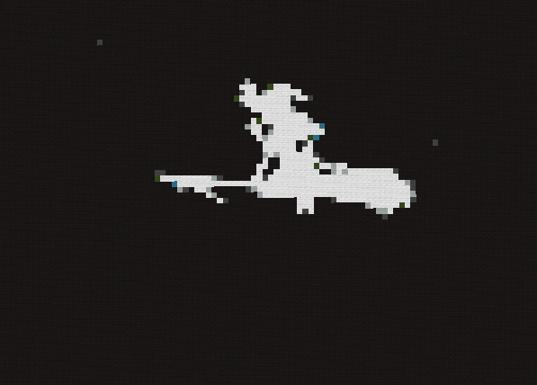

# BadApple Minecraft

Play badapple in your minecraft server

Start animation with: /badapple (frames). Example: /badapple 8

> [!NOTE]
> You need download all frames from https://github.com/pikapower9080/bad-apple-frames

